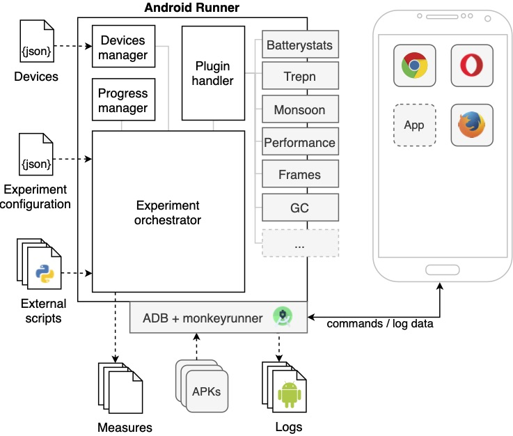

[](https://sonarcloud.io/dashboard?id=S2-group_android-runner)
[](https://travis-ci.org/S2-group/android-runner)
[](https://coveralls.io/github/S2-group/android-runner?branch=master&service=github)
# Android Runner
Android Runner (AR) is a tool for automatically executing measurement-based experiments on native and web apps running on Android devices.
As visualized below, it consists of the following components:
- **Experiment orchestrator**: Is in charge of executing the whole experiment according to the experiment configuration provided by the user.
- **Devices manager**: Is responsible for providing a layer of abstraction on the low-level operations involving the Android devices.
- **Progress manager**: Keeps track of the execution of each run of the experiment.
- **Plugin handler**: Provides a set of facilities for managing the profilers and an extension point that third-party developers can use for integrating their own measurement tools into AR.




## Install
This tool is only tested on Ubuntu, but it should work in other linux distributions.
You'll need:
- Python 3
- Android Debug Bridge (`sudo apt install android-tools-adb`)
- Android SDK Tools (`sudo apt install monkeyrunner`)
- JDK 8 (NOT JDK 9) (`sudo apt install openjdk-8-jre`)
- lxml (`sudo apt install python-lxml`)
- Install Python requirements (`pip install -r requirements.txt`)

Additionally, the following are also required for the Batterystats method:
- power_profile.xml (retrievable from the device using [APKTool](https://github.com/iBotPeaches/Apktool))
- systrace.py (from the Android SDK Tools)
- A device that is able to report on the `idle` and `frequency` states of the CPU using systrace.py

Note: It is important that monkeyrunner shares the same adb the experiment is using. Otherwise, there will be an adb restart and output may be tainted by the notification.

Note 2: You can specifiy the path to adb and/or Monkeyrunner in the experiment configuration. See the Experiment Configuration section below.

Note 3: To check whether the the device is able to report on the `idle` and `frequency` states of the CPU, you can run the command `python systrace.py -l` and ensure both categories are listed among the supported categories.

## Quick start
To run an experiment, run:
```bash
python android_runner your_config.json
```
Example configuration files can be found in the subdirectories of the `example` directory.

## Structure
### devices.json
A JSON config that maps devices names to their adb ids for easy reference in config files.

### Experiment Configuration
Below is a reference to the fields for the experiment configuration. It is not always updated.

**adb_path** *string*
Path to adb. Example path: `/opt/platform-tools/adb`

**monkeyrunner_path** *string*
Path to Monkeyrunner. Example path: `/opt/platform-tools/bin/monkeyrunner`

**systrace_path** *string*
Path to Systrace.py. Example path: `/home/user/Android/Sdk/platform-tools/systrace/systrace.py`

**powerprofile_path** *string*
Path to power_profile.xml. Example path: `android-runner/example/batterystats/power_profile.xml`

**type** *string*
Type of the experiment. Can be `web`, `native` or 'plugintest'

**device_spec** *string*
Specify this property inside of your config to specify a `devices.json` outside of the Android Runner repository. For example:

 ```js
 {
   // ....
   "type": "native",
   "devices_spec": "/home/user/experiments/devices.json",
   "devices": {
     "nexus6p": {}
   },
   // ...
 }
 ```

**repetitions** *positive integer*
Number of times each experiment is run.

**clear_cache** *boolean*
Clears the cache before every run for both web and native experiments.  Default is *false*.

**randomization** *boolean*
Random order of run execution. Default is *false*.

**duration** *positive integer*
The duration of each run in milliseconds, default is 0. Setting a too short duration may lead to missing results when running native experiments, it is advised to set a higher duration time if unexpected results appear.

**reset_adb_among_runs** *boolean*
Restarts the adb connection after each run.  Default is *false*.  Recommended to run Android Runner as a privileged user to avoid potential issues with adb device authorizaton.

**time_between_run** *positive integer*
The time that the framework waits between 2 successive experiment runs. Default is 0.

**devices** *JSON*
A JSON object to describe the devices to be used and their arguments. Below are several examples:
```js
  "devices": {
    "nexus6p": {
      "root_disable_charging": "True",
      "charging_disabled_value": 0,
      "usb_charging_disabled_file": "/sys/class/power_supply/usb/device/charge",
      "device_settings_reqs": {"e.www.gyroscopetest": ["location_high_accuracy", ...], ...}
      }
    }
  }
```

```js
  "devices": {
    "nexus6p": {
      "root_disable_charging": "False"
    }
  }
```

```js
  "devices": {
    "nexus6p": {}
  }
```
Note that the last two examples result in the same behaviour.

The **root_disable_charging** option specifies if the devices needs to be root charging disabled by writing the **charging_disabled_value** to the **usb_charging_disabled_file**. Different devices have different values for the **charging_disabled_value** and **usb_charging_disabled_file**, so be careful when using this feature. Also keep an eye out on the battery percentage when using this feature. If the battery dies when the charging is root disabled, it becomes impossible to charge the device via USB.

**device_settings_reqs** can be set to programmatically enable and disable settings on the test device.  It was added to automate the process of turning on and off location services in a randomized experiment where some applications required it and others that didn't.  Two options available currently: location services with the help of Google and one without.  **location_high_accuracy** is the option for location services with Google; **location_gps_only** is the other.  More adb commands are likely to be added in the future that work for other sensors.  Turn off location services before the experiment starts.

**WARNING:** Always check the battery settings of the device for the charging status of the device after using root disable charging.
If the device isn't charging after the experiment is finished, reset the charging file yourself via adb su command line using:
```shell
adb su -c 'echo <charging enabled value> > <usb_charging_disabled_file>'
```

**paths** *Array\<String\>*
The paths to the APKs/URLs to test with. In case of the APKs, this is the path on the local file system.

**apps** *Array\<String\>*
The package names of the apps to test when the apps are already installed on the device. For example:
```js
  "apps": [
    "org.mozilla.firefox",
    "com.quicinc.trepn"
  ]
```

**browsers** *Array\<String\>*
*Dependent on type = web*
The names of browser(s) to use. Currently supported values are `chrome`.

**profilers** *JSON*
A JSON object to describe the profiler plugins to be used and their arguments. Below, an example is found:
```json
  "profilers": {
    "trepn": {
      "sample_interval": 100,
      "data_points": ["battery_power", "mem_usage"]
    },
    "android": {
      "sample_interval": 100,
      "data_points": ["cpu", "mem"],
      "subject_aggregation": "user_subject_aggregation.py",
      "experiment_aggregation": "user_experiment_aggregation.py"
    }
  }
```
Out of the box, AR contains the plugins listed below which can immediately be used as a profiler for an experiment.

| Name (quality)                                                                       | Description                                                                                                                                                                                                                                                                                 |
|--------------------------------------------------------------------------------------|---------------------------------------------------------------------------------------------------------------------------------------------------------------------------------------------------------------------------------------------------------------------------------------------|
| [batterystats](./AndroidRunner/Plugins/batterystats/README_Batterystats.md) (Energy) | Uses the `batterystats` utility and estimates energy consumption via the algorithm proposed in [this article](https://ieeexplore.ieee.org/stamp/stamp.jsp?arnumber=7884613&casa_token=oEEnY7XOip8AAAAA:AyRZxwboUh55-n9vmW5NGT62mL_hv85T4wPGWlDQGJ36VpF3bcAV1ufvYBhsYxlB0lIMOYJ_Hc-O&tag=1). |
| [monsoon](./AndroidRunner/Plugins/monsoon/README_Monsoon.md) (Energy)                | Collects energy consumption via the Monsoon hard-ware profiler and the [Physalia tool](https://github.com/TQRG/physalia).                                                                                                                                                                   |
| [trepn](./AndroidRunner/Plugins/trepn/README_Trepn.md) (mixed)                       | Collects data via the Trepn profiler, e.g., power consumption, battery temperature, CPUs frequency.                                                                                                                                                                                         |
| [mem-CPU](./AndroidRunner/Plugins/android/README_Android.md) (Performance)           | Collects memory and CPU usage via the `cpuinfo` and `meminfo` Android utilities.                                                                                                                                                                                                            |
| [frametimes](./AndroidRunner/Plugins/frametimes/README_Frametimes.md) (Performance)  | Collects frame rendering durations and the number of delayed frames with the technique used in [this article](https://dl.acm.org/doi/pdf/10.1145/2897073.2897100?casa_token=jD3bYLV001kAAAAA:OZiAzZFwtvSO-uK3hgWlz6iNVcTt6uYoT1UWroDEGhDHrEBvLbsIl4E13RhAtRK4IaEPd6putLTzzZw).              |
| [gc](./AndroidRunner/Plugins/trepn/README_Trepn.md) (Performance)                    | Collects the number of garbage collections as in [this article](https://dl.acm.org/doi/pdf/10.1145/2897073.2897100?casa_token=jD3bYLV001kAAAAA:OZiAzZFwtvSO-uK3hgWlz6iNVcTt6uYoT1UWroDEGhDHrEBvLbsIl4E13RhAtRK4IaEPd6putLTzzZw).                                                            |

**subject_aggregation** *string*
Specify which subject aggregation to use. The default is the subject aggregation provided by the profiler. If a user specified aggregation script is used then the script should contain a ```bash main(dummy, data_dir)``` method, as this method is used as the entry point to the script.

**experiment_aggregation** *string*
Specify which experiment aggregation to use. The default is the experiment aggregation provided by the profiler. If a user specified aggregation script is used then the script should contain a ```bash main(dummy, data_dir, result_file)``` method, as this method is used as the entry point to the script.

**cleanup** *boolean*
Delete log files required by Batterystats after completion of the experiment. The default is *true*.

**scripts** *JSON*
A JSON list of types and paths of scripts to run. Below is an example:
```js
"scripts": {
  "before_experiment": "before_experiment.py",
  "before_run": "before_run.py",
  "interaction": "interaction.py",
  "after_run": "after_run.py",
  "after_experiment": "after_experiment.py"
}
```
Below are the supported types:
- before_experiment
  executes once before the first run
- before_run
  executes before every run
- after_launch
  executes after the target app/website is launched, but before profiling starts
- interaction
  executes between the start and end of a run
- before_close
  executes before the target app/website is closed
- after_run
  executes after a run completes
- after_experiment
  executes once after the last run

Instead of a path to string it is also possible to provide a JSON object in the following form:
```js
    "interaction": [
      {
        "type": "python2",
        "path": "Scripts/interaction.py",
        "timeout": 500,
        "logcat_regex": "<expr>"
      }
   ]
```
Within the JSON object you can use "type" to "python2", "monkeyrunner" or, "monkeyreplay" depending on the type of script. "python2" can be used for a standard python script,  "monkeyreplay" for running a Monkeyrunner script with the use of the Monkeyrunner framework and "monkeyrunner" can be used to run a Monkeyrunner directly without the entire Monkeyrunner framework. The "timeout" option is to set a maximum run time in miliseconds for the specified script. The optional option "logcat_regex" filters the logcat messages such that it only keeps lines where the log message matches "\<expr\>" where "\<expr\>" is a regular expression.

## Plugin profilers
It is possible to write your own profiler and use this with Android runner. To do so write your profiler in such a way
that it uses [this profiler.py class](AndroidRunner/Plugins/Profiler.py) as parent class. The device object that is mentioned within the profiler.py class is based on the device.py of this repo. To see what can be done with this object, see the source code [here](AndroidRunner/Device.py).

You can use your own profiler in the same way as the default profilers, you just need to make sure that:
- The profiler name is the same as your python file and class name.
- Your python file isn't called 'Profiler.py' as this file will be overwritten.
- The python file is placed in a directory called 'Plugin' which resided in the same directory as your config.json

To test your own profiler, you can make use of the 'plugintest' experiment type which can be seen [here](examples/plugintest/)

## Experiment continuation
In case of an error or a user abort during experiment execution, it is possible to continue the experiment if desired. This is possible by using a ```--progress``` tag with the starting command. For example:

```python android_runner your_config.json --progress path/to/progress.xml```

## Detailed documentation
The original thesis can be found here:
https://drive.google.com/file/d/0B7Fel9yGl5-xc2lEWmNVYkU5d2c/view?usp=sharing

The thesis regarding the implementation of Batterystats can be found here:
https://drive.google.com/file/d/1O7BqmkRFRDq7AD1oKOGjHqJzCTEe8AMz/view?usp=sharing

## FAQ
### Devices have no permissions (udev requires plugdev group membership)
This happens when the user calling adb is not in the plugdev group.
#### Fix
`sudo usermod -aG plugdev $LOGNAME`
#### References
https://developer.android.com/studio/run/device.html

http://www.janosgyerik.com/adding-udev-rules-for-usb-debugging-android-devices/

### [Batterystats] IOError: Unable to get atrace data. Did you forget adb root?
This happens when the device is unable to retrieve CPU information using systrace.py.
#### Fix
Check whether the device is able to report on both categories `freq` and `idle` using Systrace:

`python systrace.py -l`

If the categories are not listed, use a different device.
#### References
https://developer.android.com/studio/command-line/systrace
